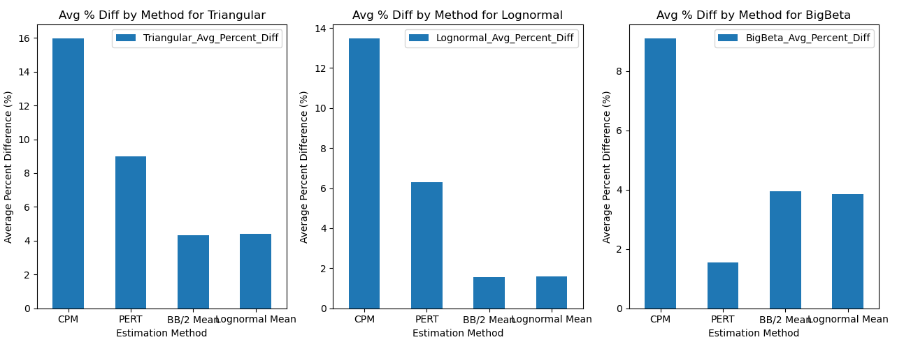
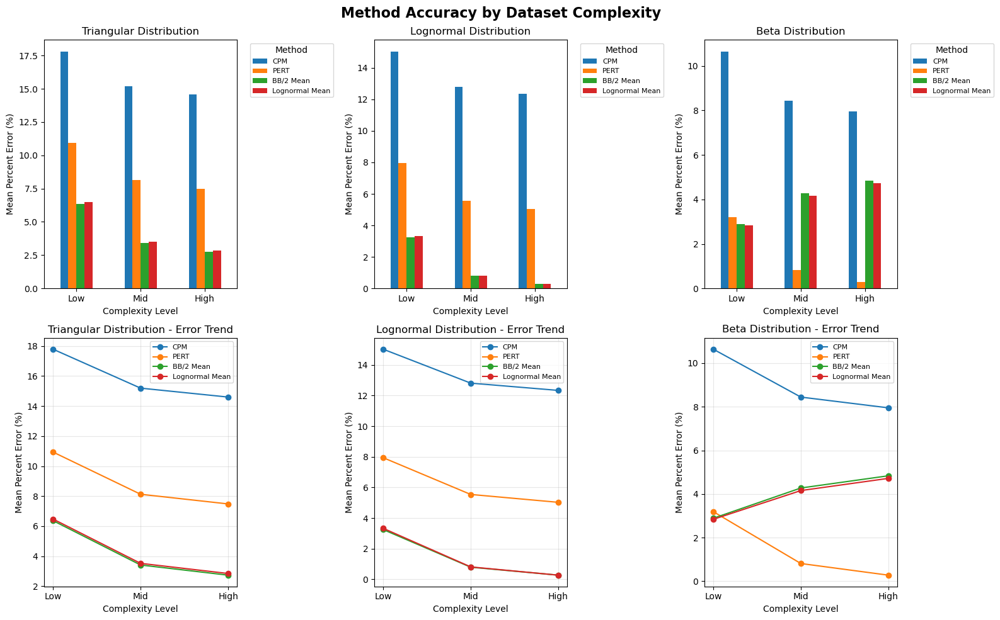
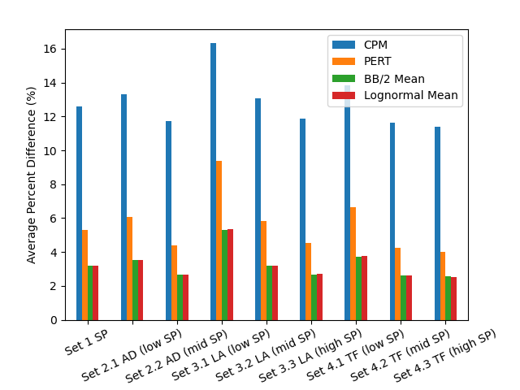

# Jupyter Notebook Data Analysis Summary

This document summarizes the analyses performed in the notebook `Code/Jupyter_Test_Env.ipynb`, including datasets processed, raw numeric results, interpretation, and the supporting visualizations created in the notebook.

---

## 1. Datasets and Processing

The notebook evaluates estimation method accuracy using simulated project completion time datasets for three probability distributions:

- Triangular
- Lognormal
- Beta

For each distribution, the notebook processes nine datasets representing different activity types and complexity levels (SP, AD, LA, TF and low/mid/high SP):

```text
Triangular datasets
- Set 1 SP Completion Times - Triangular.csv
- Set 2.1 AD (low SP) Completion Times - Triangular.csv
- Set 2.2 AD (mid SP) Completion Times - Triangular.csv
- Set 3.1 LA (low SP) Completion Times - Triangular.csv
- Set 3.2 LA (mid SP) Completion Times - Triangular.csv
- Set 3.3 LA (high SP) Completion Times - Triangular.csv
- Set 4.1 TF (low SP) Completion Times - Triangular.csv
- Set 4.2 TF (mid SP) Completion Times - Triangular.csv
- Set 4.3 TF (high SP) Completion Times - Triangular.csv

Lognormal datasets
- Set 1 SP Completion Times - Lognormal.csv
- Set 2.1 AD (low SP) Completion Times - Lognormal.csv
- Set 2.2 AD (mid SP) Completion Times - Lognormal.csv
- Set 3.1 LA (low SP) Completion Times - Lognormal.csv
- Set 3.2 LA (mid SP) Completion Times - Lognormal.csv
- Set 3.3 LA (high SP) Completion Times - Lognormal.csv
- Set 4.1 TF (low SP) Completion Times - Lognormal ln.csv
- Set 4.2 TF (mid SP) Completion Times - Lognormal.csv
- Set 4.3 TF (high SP) Completion Times - Lognormal.csv

Beta datasets
- Set 1 SP Completion Times - Beta.csv
- Set 2.1 AD (low SP) Completion Times - Beta.csv
- Set 2.2 AD (mid SP) Completion Times - Beta.csv
- Set 3.1 LA (low SP) Completion Times - Beta.csv
- Set 3.2 LA (mid SP) Completion Times - Beta.csv
- Set 3.3 LA (high SP) Completion Times - Beta.csv
- Set 4.1 TF (low SP) Completion Times - Beta.csv
- Set 4.2 TF (mid SP) Completion Times - Beta.csv
- Set 4.3 TF (high SP) Completion Times - Beta.csv
```

For each file, the notebook computes absolute percent differences between each estimation method and the simulated mean, then averages these errors across all files within a distribution.

---

## 2. Overall Average Percent Difference Results

The core numeric output of the notebook is the average percent difference (mean absolute percent error) by method and distribution. Values below are taken directly from the notebook's printed output.

### 2.1 Triangular Distribution

```text
Average Triangular Percent Difference by Column:
--------------------------------------------------
Low Complexity:
  CPM                 :  17.79%
  PERT                :  10.93%
  BB/2 Mean           :   6.37%
  Lognormal Mean      :   6.47%

Mid Complexity:
  CPM                 :  15.19%
  PERT                :   8.13%
  BB/2 Mean           :   3.41%
  Lognormal Mean      :   3.52%

High Complexity:
  CPM                 :  14.60%
  PERT                :   7.48%
  BB/2 Mean           :   2.74%
  Lognormal Mean      :   2.85%
```

### 2.2 Lognormal Distribution

```text
Average Lognormal Percent Difference by Column:
--------------------------------------------------
Low Complexity:
  CPM                 :  15.02%
  PERT                :   7.94%
  BB/2 Mean           :   3.25%
  Lognormal Mean      :   3.33%

Mid Complexity:
  CPM                 :  12.81%
  PERT                :   5.54%
  BB/2 Mean           :   0.79%
  Lognormal Mean      :   0.81%

High Complexity:
  CPM                 :  12.33%
  PERT                :   5.03%
  BB/2 Mean           :   0.27%
  Lognormal Mean      :   0.27%
```

### 2.3 Beta Distribution

```text
Average Beta Percent Difference by Column:
--------------------------------------------------
Low Complexity:
  CPM                 :  10.64%
  PERT                :   3.19%
  BB/2 Mean           :   2.89%
  Lognormal Mean      :   2.84%

Mid Complexity:
  CPM                 :   8.44%
  PERT                :   0.81%
  BB/2 Mean           :   4.28%
  Lognormal Mean      :   4.16%

High Complexity:
  CPM                 :   7.95%
  PERT                :   0.28%
  BB/2 Mean           :   4.84%
  Lognormal Mean      :   4.72%
```

### 2.4 Interpretation of Overall Results

- CPM has the highest average percent error for all three distributions and at every complexity level, indicating it is consistently the least accurate estimator in this simulation study.
- PERT performs substantially better than CPM across all distributions, especially for the Beta distribution where its errors are lowest at all complexity levels.
- BB/2 Mean and Lognormal Mean are the best-performing methods for the Triangular and Lognormal distributions, with very small errors at mid and high complexity.
- For the Beta distribution, PERT is usually the most accurate method, while BB/2 Mean and Lognormal Mean still perform well but are slightly less accurate than PERT at higher complexity.
- Overall, the Beta distribution yields the lowest percent errors for the best-performing methods, suggesting that the estimation procedures align particularly well with that distribution.

---

## 3. Overall Time Difference from Sim Mean

In addition to percent error, the notebook also examines the **average time difference** between each estimation method and the simulated mean (`Sim Mean`). These time differences are expressed in the same time units as the simulation outputs (e.g., days) and provide an intuitive sense of how far off each method is in actual time.

For each distribution and complexity level, the notebook prints tables summarizing the mean time difference between the estimates and the simulated mean.

### 3.1 Triangular Distribution

```text
Average Triangular Time Difference by Column:
--------------------------------------------------
Low Complexity:
  CPM                 :    -8.61 days
  PERT                :    -5.34 days
  BB/2 Mean           :    -3.17 days
  Lognormal Mean      :    -3.22 days

Mid Complexity:
  CPM                 :   -15.61 days
  PERT                :    -8.37 days
  BB/2 Mean           :    -3.55 days
  Lognormal Mean      :    -3.67 days

High Complexity:
  CPM                 :   -23.06 days
  PERT                :   -11.82 days
  BB/2 Mean           :    -4.33 days
  Lognormal Mean      :    -4.50 days
```

### 3.2 Lognormal Distribution

```text
Average Lognormal Time Difference by Column:
--------------------------------------------------
Low Complexity:
  CPM                 :    -7.02 days
  PERT                :    -3.75 days
  BB/2 Mean           :    -1.58 days
  Lognormal Mean      :    -1.63 days

Mid Complexity:
  CPM                 :   -12.79 days
  PERT                :    -5.56 days
  BB/2 Mean           :    -0.73 days
  Lognormal Mean      :    -0.85 days

High Complexity:
  CPM                 :   -18.98 days
  PERT                :    -7.74 days
  BB/2 Mean           :    -0.24 days
  Lognormal Mean      :    -0.42 days
```

### 3.3 Beta Distribution
```text
Average Beta Time Difference by Column:
--------------------------------------------------
Low Complexity:
  CPM                 :    -4.76 days
  PERT                :    -1.49 days
  BB/2 Mean           :     0.69 days
  Lognormal Mean      :     0.64 days

Mid Complexity:
  CPM                 :    -8.04 days
  PERT                :    -0.81 days
  BB/2 Mean           :     4.01 days
  Lognormal Mean      :     3.90 days

High Complexity:
  CPM                 :   -11.65 days
  PERT                :    -0.41 days
  BB/2 Mean           :     7.08 days
  Lognormal Mean      :     6.91 days
```

### 3.4 Interpretation of Time Difference Results

- The ranking of methods by **time difference from `Sim Mean`** is broadly consistent with the ranking by percent error in Section 2.
- Methods that minimize percent error (PERT for Beta, BB/2 Mean and Lognormal Mean for Triangular and Lognormal) also minimize average time deviation, making them more reliable choices both statistically and practically.
- CPM’s higher percent errors correspond to larger expected schedule deviations, reinforcing the conclusion that it is the least reliable estimator across these simulated scenarios.

---

## 4. Method Performance by Dataset Complexity

The notebook also breaks down estimation accuracy by dataset complexity level (e.g., Low, Mid, High complexity) for each distribution. It then produces bar charts and line plots to visualize how error changes with complexity.

### 4.1 Visualizations Created in the Notebook

The notebook generates:

1. **Average Percent Difference by Distribution (Bar Charts)**
   - Three stacked bar charts (one for Triangular, one for Beta, one for Lognormal).
   - Each chart shows mean percent error for CPM, PERT, BB/2 Mean, and Lognormal Mean.

2. **Method Accuracy by Dataset Complexity**
   - Top row: grouped bar charts showing mean percent error by method (CPM, PERT, BB/2 Mean, Lognormal Mean) at Low, Mid, and High complexity for each distribution.
   - Bottom row: corresponding line plots (error trends) for each method across complexity levels for each distribution.

3. **Average Perent Difference by Dataset (Bar Chart)**
    - Nine stacked bar charts (one for each dataset).
    - Each chart shows Average Percent Difference from the Simulation Mean for each Estimation method (CPM, PERT, BB/2, Lognormal).







### 4.2 Qualitative Findings from Complexity Analysis

Based on the complexity visualizations:

- **CPM** remains the worst-performing method at every complexity level and for every distribution, though its error tends to decrease slightly as complexity increases.
- **PERT** improves with complexity and is particularly strong for the Beta distribution, reaching very low errors at higher complexity.
- **BB/2 Mean** and **Lognormal Mean** show very low errors for the Lognormal distribution, especially at higher complexity levels, and are competitive for the Triangular distribution.
- Across all distributions, methods generally exhibit **decreasing percent error from Low to High complexity**, suggesting that estimation methods perform more reliably on larger or more complex datasets in this simulation setup.

---

## 5. How to Use These Results

- For **Triangular datasets**, BB/2 Mean and Lognormal Mean provide substantially better accuracy than CPM and noticeably better accuracy than PERT.
- For **Lognormal datasets**, BB/2 Mean and Lognormal Mean are clearly preferred, with very small average errors (~1.6%).
- For **Beta datasets**, PERT is the best choice, with BB/2 Mean and Lognormal Mean as strong alternatives and CPM clearly inferior.
- When choosing an estimation method in practice, these results suggest prioritizing:
  - PERT or Lognormal Mean when the underlying behavior is closer to Lognormal or Beta.
  - BB/2 Mean or Lognormal Mean for skewed or uncertain distributions similar to the Triangular or Lognormal simulations.

These conclusions are specific to the simulated datasets and assumptions used in this notebook but provide an empirical basis for comparing common project-duration estimation methods across different distributional settings and complexity levels.
