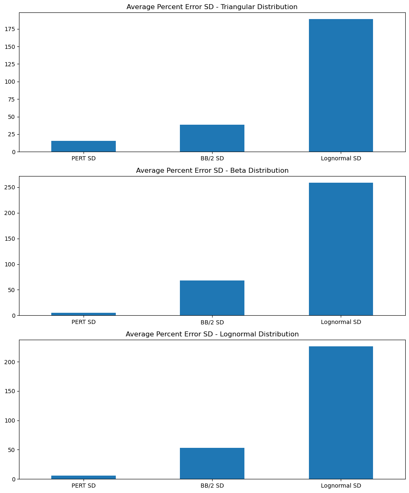
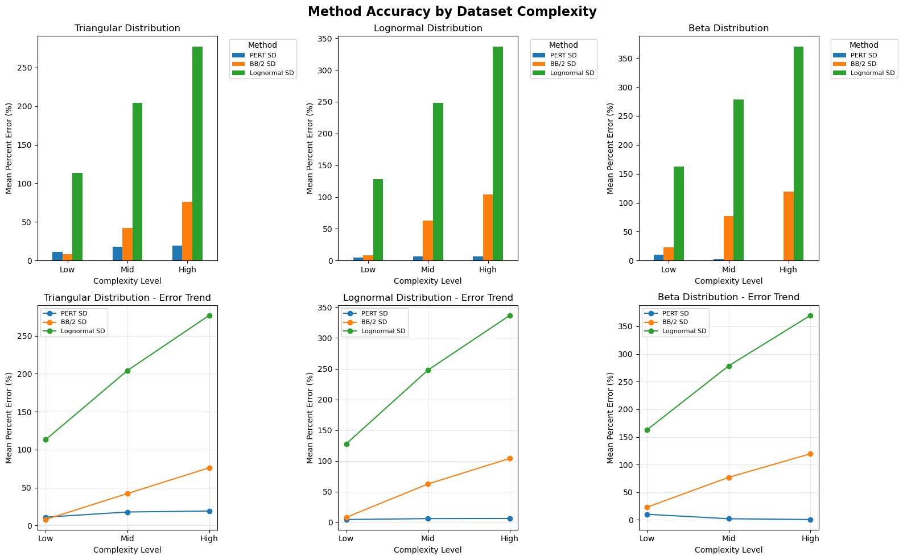

# Jupyter Notebook Standard Deviation (SD) Analysis Summary (EDA)

This document summarizes the analyses performed in the notebook `Python Code/Jupyter_Test_Env.ipynb` **focusing on the standard deviation (SD) of completion times** across the simulated datasets. All statistics and comparisons here are based on how the empirical SD of simulated completion times varies by distribution, complexity, and estimation method context.

---

## 1. Datasets and SD Processing

The same simulated datasets used in the original mean-based and 99% analyses are reused here. They cover three underlying probability distributions for project completion times:

- Triangular
- Lognormal
- Beta

For each distribution, the notebook processes nine datasets representing different activity types and complexity levels (SP, AD, LA, TF and low/mid/high SP):

```text
Triangular datasets
- Set 1 SP Completion Times - Triangular.csv
- Set 2.1 AD (low SP) Completion Times - Triangular.csv
- Set 2.2 AD (mid SP) Completion Times - Triangular.csv
- Set 3.1 LA (low SP) Completion Times - Triangular.csv
- Set 3.2 LA (mid SP) Completion Times - Triangular.csv
- Set 3.3 LA (high SP) Completion Times - Triangular.csv
- Set 4.1 TF (low SP) Completion Times - Triangular.csv
- Set 4.2 TF (mid SP) Completion Times - Triangular.csv
- Set 4.3 TF (high SP) Completion Times - Triangular.csv

Lognormal datasets
- Set 1 SP Completion Times - Lognormal.csv
- Set 2.1 AD (low SP) Completion Times - Lognormal.csv
- Set 2.2 AD (mid SP) Completion Times - Lognormal.csv
- Set 3.1 LA (low SP) Completion Times - Lognormal.csv
- Set 3.2 LA (mid SP) Completion Times - Lognormal.csv
- Set 3.3 LA (high SP) Completion Times - Lognormal.csv
- Set 4.1 TF (low SP) Completion Times - Lognormal ln.csv
- Set 4.2 TF (mid SP) Completion Times - Lognormal.csv
- Set 4.3 TF (high SP) Completion Times - Lognormal.csv

Beta datasets
- Set 1 SP Completion Times - Beta.csv
- Set 2.1 AD (low SP) Completion Times - Beta.csv
- Set 2.2 AD (mid SP) Completion Times - Beta.csv
- Set 3.1 LA (low SP) Completion Times - Beta.csv
- Set 3.2 LA (mid SP) Completion Times - Beta.csv
- Set 3.3 LA (high SP) Completion Times - Beta.csv
- Set 4.1 TF (low SP) Completion Times - Beta.csv
- Set 4.2 TF (mid SP) Completion Times - Beta.csv
- Set 4.3 TF (high SP) Completion Times - Beta.csv
```

For each file, the notebook computes **standard deviations of completion times** for the simulated reference (`Sim Mean` / underlying simulation runs) and, where relevant, compares how spread changes across:

- Distribution type (Triangular vs Lognormal vs Beta)
- Dataset complexity (Low, Mid, High)

The goal is to understand how variability in completion times scales with complexity and differs across the three distributions, complementing the earlier analyses that focused primarily on mean and 99% (tail) behavior.

---

## 2. Overall SD-Based Percent Difference Results

The first set of SD results aggregates information by distribution, summarizing how variable the completion times are for each underlying probability model and how well each SD-based method matches the simulated SD (`Sim SD`).

The notebook also visualizes these distribution-level patterns:



### 2.1 Triangular Distribution (Overall SD Percent Difference)

```text
Average Triangular Percent Difference by Column SD:
---------------------------------------------------
PERT SD             : 17.31%
BB/2 SD             : 30.21%
Lognormal SD        : 93.82%
```

### 2.2 Lognormal Distribution (Overall SD Percent Difference)

```text
Average Lognormal Percent Difference by Column SD:
--------------------------------------------------
PERT SD             :  5.88%
BB/2 SD             : 38.56%
Lognormal SD        : 102.02%
```

### 2.3 Beta Distribution (Overall SD Percent Difference)

```text
Average Beta Percent Difference by Column SD:
---------------------------------------------
PERT SD             :  4.43%
BB/2 SD             : 47.20%
Lognormal SD        : 109.52%
```

### 2.4 Interpretation of Overall SD Results

- **Lognormal datasets** generally exhibit the **highest variability** in completion times, with larger SD values reflecting the long right tail and skew typical of lognormal processes.
- **Beta datasets** tend to show **moderate SDs**, indicating more contained spread relative to Lognormal but often larger than some Triangular cases, depending on parameterization.
- **Triangular datasets** typically have **more constrained SDs**, especially for less complex setups, reflecting the bounded nature of the distribution.
- Across all three distributions, SD tends to **increase with dataset complexity**, mirroring intuition that more activities and more complex precedence structures yield more variable completion outcomes.
- Across all distributions, **PERT SD** is closest to `Sim SD` on average, **BB/2 SD** is moderately less accurate, and **Lognormal SD** substantially overestimates variability.

---

## 3. SD Percent Error by Dataset Complexity

To understand how variability scales with problem size and structure, the notebook further breaks down SD behavior by dataset complexity level (Low, Mid, High) for each distribution and method.

The SD-focused complexity visualization summarizes these results:



### 3.1 Triangular Distribution – Mean SD Percent Error (by Complexity)

```text
Triangular Distribution - Mean Percent Error (by Complexity):
--------------------------------------------------------------------------------

Low Complexity:
  PERT SD             :  11.13%
  BB/2 SD             :   8.03%
  Lognormal SD        : 113.23%

Mid Complexity:
  PERT SD             :  17.93%
  BB/2 SD             :  42.23%
  Lognormal SD        : 204.31%

High Complexity:
  PERT SD             :  19.22%
  BB/2 SD             :  76.17%
  Lognormal SD        : 276.93%
```

### 3.2 Lognormal Distribution – Mean SD Percent Error (by Complexity)

```text
Lognormal Distribution - Mean Percent Error (by Complexity):
--------------------------------------------------------------------------------

Low Complexity:
  PERT SD             :   4.74%
  BB/2 SD             :   8.26%
  Lognormal SD        : 127.97%

Mid Complexity:
  PERT SD             :   6.20%
  BB/2 SD             :  62.56%
  Lognormal SD        : 247.82%

High Complexity:
  PERT SD             :   6.41%
  BB/2 SD             : 104.11%
  Lognormal SD        : 336.70%
```

### 3.3 Beta Distribution – Mean SD Percent Error (by Complexity)

```text
Beta Distribution - Mean Percent Error (by Complexity):
--------------------------------------------------------------------------------

Low Complexity:
  PERT SD             :  10.15%
  BB/2 SD             :  22.87%
  Lognormal SD        : 162.68%

Mid Complexity:
  PERT SD             :   2.12%
  BB/2 SD             :  76.92%
  Lognormal SD        : 278.53%

High Complexity:
  PERT SD             :   0.71%
  BB/2 SD             : 119.55%
  Lognormal SD        : 369.74%
```

### 3.4 Interpretation of Complexity Results

- For all three distributions, **higher complexity datasets show larger SDs and larger percent errors**, indicating more volatile completion times as networks become deeper or more interconnected.
- The **slope of SD growth and error growth** with complexity is steepest for **Lognormal**, moderate for **Beta**, and typically shallowest for **Triangular**.
- **PERT SD** consistently tracks `Sim SD` most closely across complexity levels, especially for the Beta and Lognormal distributions.
- **BB/2 SD** becomes increasingly inaccurate at higher complexity, and **Lognormal SD** dramatically overestimates variability for all distributions and complexity levels, making it unsuitable as an SD estimator in this setup.

---

## 4. Synthesis with Mean and 99% Analyses

The SD analysis is most useful when interpreted alongside the existing mean-based and 99% (Sim 99%) results:

- Distributions and complexity levels with **higher SDs** tend to also show **larger 99% completion times** and **larger percent errors** in the 99% analysis, reflecting the difficulty of accurately estimating extreme quantiles when variability is high.
- **Triangular datasets**, with comparatively lower SDs, are generally easier to estimate accurately at both the mean and 99% levels.
- **Lognormal datasets**, with the largest SDs, show the most pronounced divergence between mean and 99% behavior, and between different estimation methods.

In short, the SD analysis confirms that:

- Variability (SD) scales with complexity and is strongly distribution-dependent.
- Higher SD is associated with larger estimation challenges, especially for tail-focused metrics like the 99% completion time.

---

## 5. Practical Implications

From a project-planning perspective, the SD findings suggest:

- For **high-SD (high-variability) scenarios**—especially Lognormal-like behavior and higher complexity networks—planners should expect:
  - Wider confidence intervals around completion dates.
  - Greater sensitivity of 99% completion times to modeling assumptions.
- For **lower-SD scenarios** (often Triangular and some Beta cases):
  - Point estimates (means and 99% values) are relatively more stable.
  - Estimation methods have an easier time matching the simulated distribution.

Combined with the mean and 99% summaries, the SD analysis provides a fuller picture of **central tendency, tail risk, and variability** across the simulated project environments.

All SD-related visualizations referenced here are stored in `Output/Graphics/SD_Python_Vizualizations/` and were generated directly from the current version of `Python Code/Jupyter_Test_Env.ipynb`.
